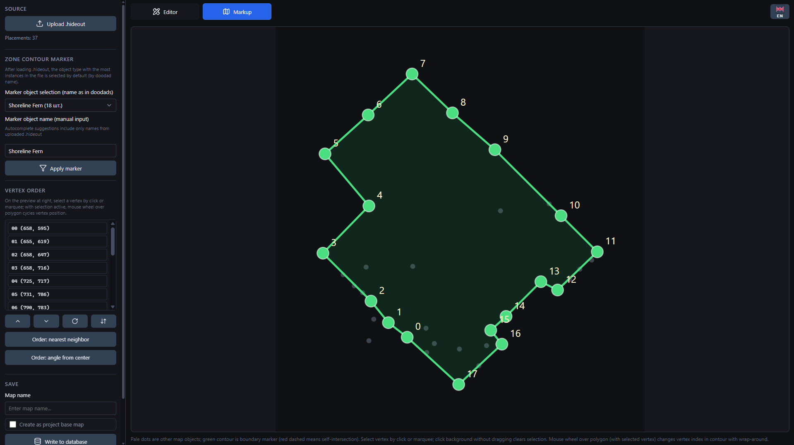
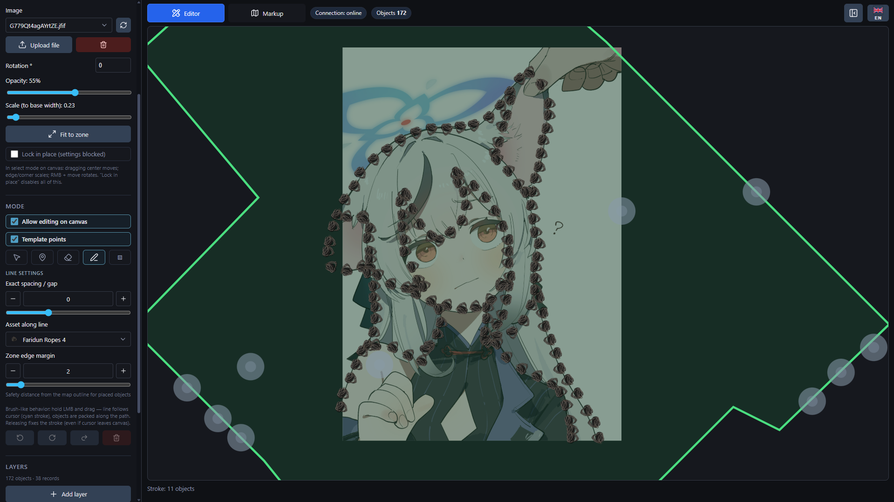
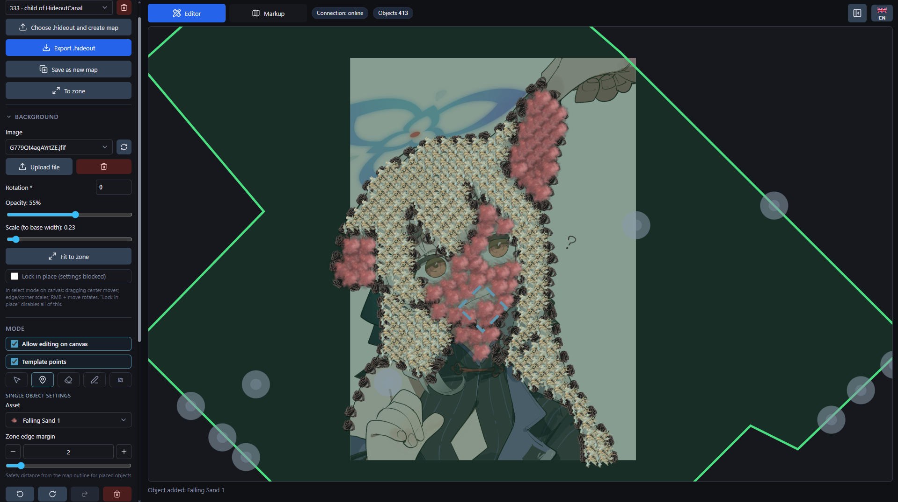

**English** | [Русский](README.ru.md)

## Screenshots








## What you need

- Python 3.10 or newer
- Node.js 22 (LTS) or newer — CI is pinned to Node 22
- npm 10 or newer — ships together with Node.js 22
- Git, only if you want to update the project with `git pull`

## How to start

From a downloaded archive or a cloned repository, open the project folder and run:

```bash
python dev.py
```

On macOS or Linux, use this command if `python` points to Python 2 or is not found:

```bash
python3 dev.py
```

On Windows you can also double-click `Start.bat`.

The first start may take a while because the script prepares the project:

1. creates `.venv` for Python packages;
2. installs backend dependencies from `requirements-api.txt`;
3. installs frontend dependencies inside `frontend/node_modules`;
4. starts the backend and the frontend.

When the script says that everything is up, open:

- app: http://localhost:5173
- API docs: http://127.0.0.1:8000/api/docs
- backend health check: http://127.0.0.1:8000/api/health

If your system resolves `python` to Python 3, you can use the root npm wrapper:

```bash
npm start
```

If your machine only has `python3`, prefer `python3 dev.py` directly because the
root npm script still calls `python`.

To stop the app, return to the terminal and press `Ctrl+C`.

## Updating

If you cloned the project with Git:

```bash
git pull
python dev.py
```

If your machine only has `python3`, use `python3 dev.py` after `git pull`.

On Windows, `UpdateAndStart.bat` does the same thing: it runs `git pull` and then starts the app.

If dependencies changed, or the project starts with strange errors, rebuild local dependencies:

```bash
python dev.py --reinstall
```

If your machine only has `python3`, run `python3 dev.py --reinstall`.

Your local data is stored in `hideout_settings/`, `hideout_scenes/`, `input/images/`, and `logs/`. These folders are ignored by Git and are not added to the release archive. The `input/hideout/` folder is the exception: it ships a small set of sample `.hideout` maps to use as starting points (see [Boundary marking page](#boundary-marking-page)).

## Useful start flags

```bash
python dev.py --skip-install  # start faster, without reinstalling packages
python dev.py --reinstall     # remove .venv and frontend/node_modules, then install again
python dev.py --dev           # backend auto-reload for development
python dev.py --no-browser    # do not open the browser automatically
```

Ports can be changed through environment variables:

| Variable                       | Default     | What it changes |
| ------------------------------ | ----------- | --------------- |
| `HIDEOUT_EDITOR_BACKEND_HOST`  | `127.0.0.1` | backend host    |
| `HIDEOUT_EDITOR_BACKEND_PORT`  | `8000`      | backend port    |
| `HIDEOUT_EDITOR_FRONTEND_PORT` | `5173`      | frontend port   |

## Boundary marking page

The boundary marking page (the first screenshot above) turns a hideout dump
file (`.hideout`) into the closed polygon that defines the playable area.
Open the app and switch to the **Boundary** tab.

**Loading a source file.** Two options:

1. **Upload .hideout** — opens the system file picker. Use it for your own
   exports.
2. **Sample maps** — a dropdown next to the upload button. Pick any of the
   sample maps that ship under [`input/hideout/`](input/hideout/) and the
   page loads it through the same parser as a manual upload. The samples
   are a few small base maps I prepared by hand; treat them as starting
   points or reference templates.

**Building the boundary.** Once a file is loaded:

1. The page picks the most frequent doodad type as the boundary marker
   (e.g. the type you placed manually in the game to outline the zone).
   Override it via **Zone contour marker → Marker object selection** or by
   typing a different doodad name.
2. The polygon preview on the right shows the marker points (green) and
   the rest of the map (pale). Click a vertex or drag a marquee to select
   it; the mouse wheel cycles the selected vertex through the order.
3. The **Vertex order** controls reorder one vertex at a time, reverse the
   ring, or apply an automatic heuristic (nearest-neighbour / polar
   angle).
4. The contour must close cleanly: a red dashed segment means
   self-intersection — fix it before saving.

**Saving.** Enter a map name and press **Write to database**. Tick
_Create as project base map_ if this should appear in the editor's base
map list. From that point on you can switch to the editor tab, place
decorations on top, and export the final `.hideout`.

## Project layout

- `backend/` — FastAPI app, map storage, import/export endpoints.
- `frontend/` — React/Vite interface.
- `hideout_core/` — shared Python logic.
- `backend/seed_data/` — catalog data needed by the backend.
- `shared/` — generated scene contract artifacts and editor asset catalog.
- `docs/` — installation, update, and troubleshooting notes.
- `input/hideout/` — sample base `.hideout` maps shipped with the project,
  exposed on the boundary marking page as **Sample maps**.
- `scripts/` — helper scripts for maintainers.
- `tests/` — backend tests.

## Documentation

- [Installation](docs/INSTALL.md)
- [Updating](docs/UPDATE.md)
- [Troubleshooting](docs/TROUBLESHOOTING.md)

## License

MIT. See [LICENSE](LICENSE).
